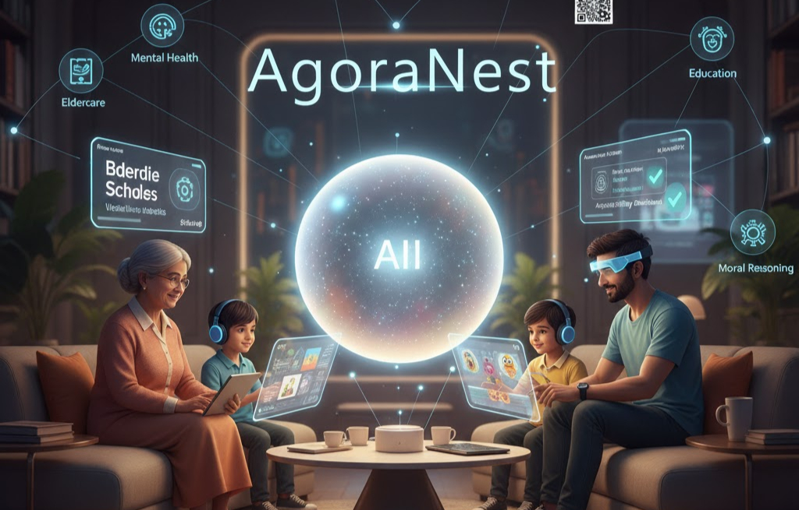
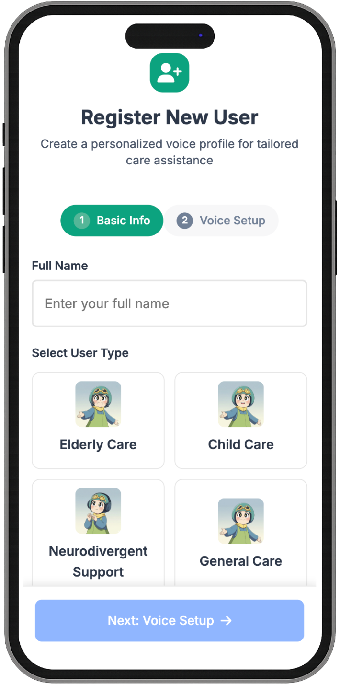
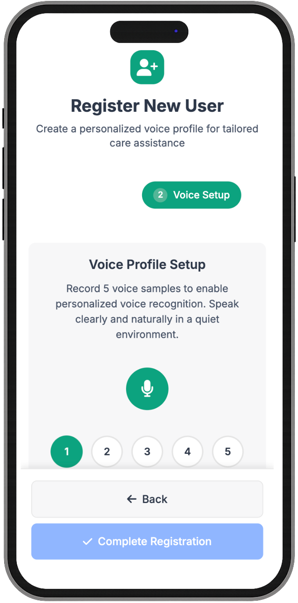
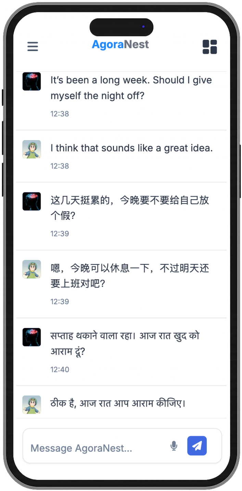
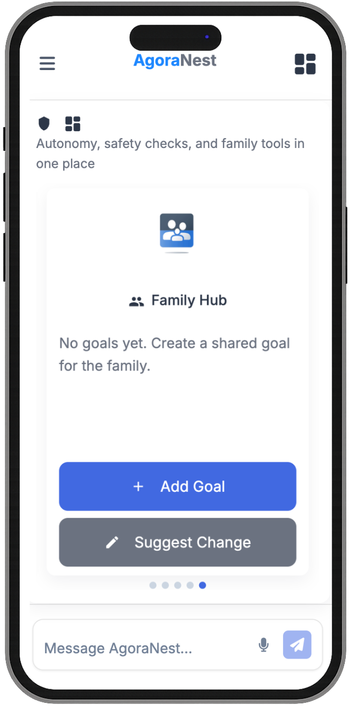
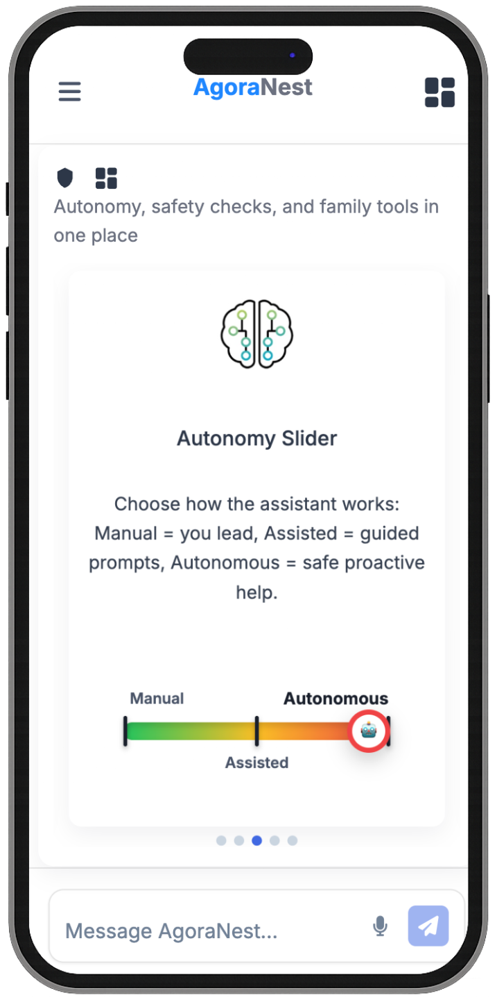
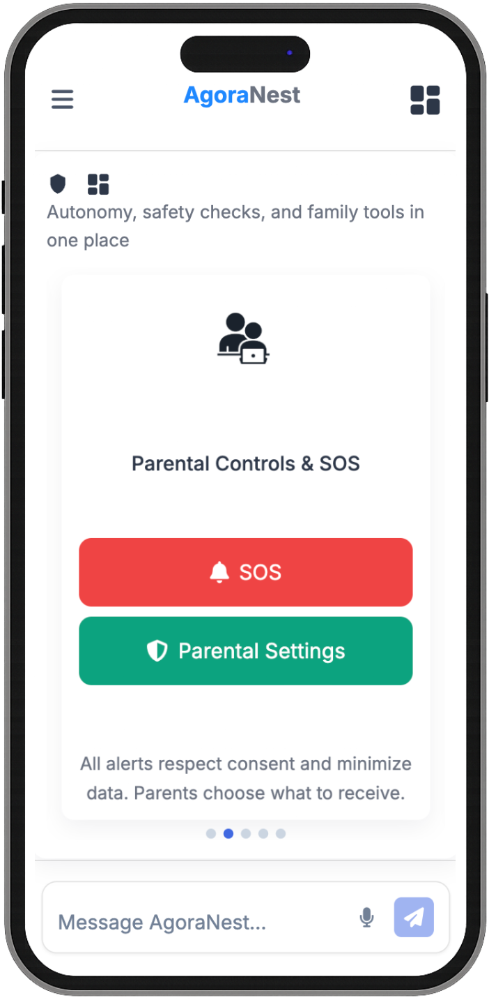
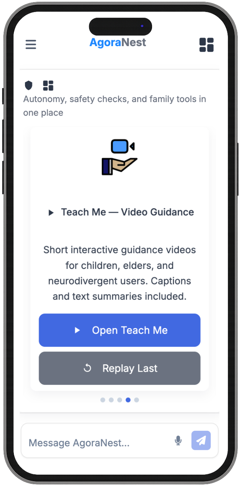
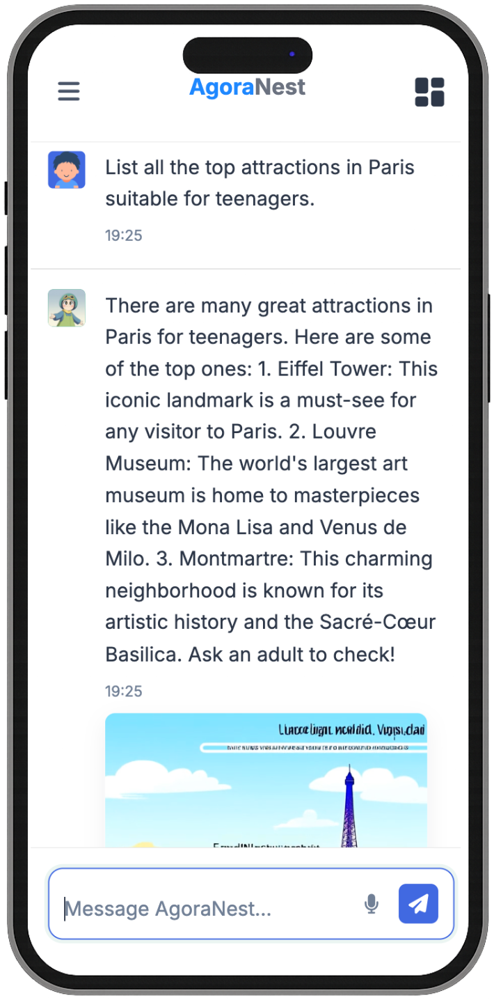

<div align="center">
  
  
  # AgoraNest
  
  ### Comprehensive Multi-Domain Care AI Assistant with Voice Recognition & Memory

<div align="center">
<a href="https://arxiv.org/abs/2510.19008"></a>
<a href="https://huggingface.co/JoydeepC/Agora-4B"></a>
<a href="https://huggingface.co/datasets/navneetsatyamkumar/agora-synthetic-home-100k"></a>
<a href="LICENSE"></a>
<hr>
</div>
  
  *An intelligent, voice-enabled AI care assistant supporting elderly care, child care, neurodivergent support, and smart home automation*
  
</div>

---

## Table of Contents

- [Overview](#overview)
- [Key Features](#key-features)
- [Care Domains](#care-domains)
- [Installation](#installation)
- [Usage](#usage)
- [Screenshots](#screenshots)
- [Research Background](#research-background)
- [Technology Stack](#technology-stack)
- [Contributing](#contributing)
- [License](#license)

## Overview

**AgoraNest** is a next-generation, comprehensive care AI assistant that combines advanced voice recognition, natural language processing, and contextual memory to provide personalized support across multiple care domains. Built on fine-tuned Qwen3 transformer models and enhanced with biometric voice authentication, AgoraNest delivers secure, intelligent assistance for:

- **Elderly Care** - Health management, medication reminders, safety monitoring
- **Child Care** - Developmental support, educational activities, parenting guidance
- **Neurodivergent Support** - Communication strategies, sensory management, routine building
- **Smart Home Automation** - Device control, energy optimization, security management
- **General Care** - Daily routines, wellness tracking, productivity assistance

The system features a user-friendly web interface with real-time voice interaction, persistent conversation memory, and actionable response capabilities for task execution and automation.

## Key Features

### Advanced Voice Recognition System
- **Biometric Voice Authentication** - Secure user identification using voice fingerprinting
- **Multi-Sample Registration** - 5-sample voice profile creation for robust recognition
- **Real-time Speech-to-Text** - Google Speech Recognition integration
- **Text-to-Speech Response** - Natural voice output with customizable voices
- **Voice Activity Detection** - WebRTC VAD for accurate speech detection
- **Feature Extraction** - MFCC, spectral, and prosodic voice features using librosa

### Intelligent AI Core
- **Fine-tuned Qwen3 Model** - Specialized for comprehensive care scenarios
- **Context-Aware Responses** - Leverages user profiles and conversation history
- **Multi-Domain Expertise** - Specialized system prompts for each care type
- **Memory Management** - Persistent conversation logs and user preferences
- **Actionable Intent Detection** - Recognizes and executes task commands
- **Confidence Scoring** - Speaker identification with confidence metrics

### Memory & User Management
- **User Profiles** - Persistent storage of preferences, medical info, and routines
- **Conversation History** - Full conversation logging with CSV export
- **Reminder System** - Set and manage reminders for users
- **Session Tracking** - Interaction count and last activity monitoring
- **Profile Switching** - Multi-user support with quick profile switching
- **Data Persistence** - JSON and pickle-based storage for reliability

### Web Interface
- **Real-time Communication** - Flask-SocketIO for instant voice/text interaction
- **Responsive Design** - Mobile-friendly interface for all devices
- **Multi-Language Support** - Extensible language support framework
- **Dashboard Visualization** - User analytics and conversation insights
- **Registration Portal** - Easy voice enrollment and profile creation
- **SOS Emergency Features** - Quick access to emergency contacts and alerts

### Security & Privacy
- **Voice Biometric Security** - SVM-based speaker identification
- **Local Data Storage** - All sensitive data stored locally
- **Session Management** - Secure Flask session handling
- **Confidence Thresholds** - Prevents unauthorized access via low confidence rejection

### Actionable Capabilities
- Medication and appointment reminders
- Task scheduling and routine automation
- Emergency calling and SOS alerts
- Smart home device control
- Voice-activated commands
- Health and activity tracking

### Core Components

1. **VoiceRecognitionSystem** - Handles voice recording, feature extraction, and speaker identification
2. **ComprehensiveCareAI** - Main AI orchestrator with model loading and response generation
3. **MemoryManager** - Manages user profiles and conversation persistence
4. **TextToSpeechEngine** - Converts AI responses to natural speech
5. **ActionableResponseSystem** - Detects and executes task commands
6. **ConversationLogger** - Logs all interactions to CSV for analytics

## Care Domains

### Elderly Care Assistant
- Health management and wellness tracking
- Medication reminders and adherence monitoring
- Fall detection and safety alerts
- Social engagement suggestions
- Caregiver support and resources
- Memory aid and cognitive exercises

### Child Care Assistant
- Developmental milestone tracking
- Educational activity suggestions
- Nutrition and meal planning
- Behavior management strategies
- Sleep schedule optimization
- Safety tips and childproofing guidance

### Neurodivergent Support Assistant
- Communication strategy development
- Sensory overload management
- Routine building and maintenance
- Environmental modification tips
- Social skills support
- Anxiety and stress reduction techniques

### Smart Home Automation Assistant
- Device control and automation
- Energy usage optimization
- Security system management
- Lighting and temperature control
- Routine automation creation
- Multi-device orchestration

### General Care Assistant
- Daily routine management
- Wellness and fitness tracking
- Productivity enhancement
- Home organization tips
- General life assistance
- Information retrieval

## Installation

### Prerequisites

- Python 3.8 or higher
- CUDA-enabled GPU (optional, for faster inference)
- Microphone and speakers (for voice features)
- 8GB+ RAM (16GB+ recommended)

### Step 1: Clone the Repository

```bash
git clone https://github.com/Satyamkumarnavneet/AgoraNest.git
cd AgoraNest
```

### Step 2: Create Virtual Environment

```bash
python3 -m venv agoranest
source agoranest/bin/activate  # On Windows: agoranest\Scripts\activate
```

### Step 3: Install Dependencies

```bash
pip install -r requirements.txt
```

### Step 4: Install System Dependencies

**For macOS:**
```bash
brew install portaudio
```

**For Ubuntu/Debian:**
```bash
sudo apt-get install portaudio19-dev python3-pyaudio
```

**For Windows:**
```bash
# PyAudio wheels are included in requirements.txt
```

### Step 5: Download the Fine-tuned Model

The project uses the **Agora-4B** model, a fine-tuned Qwen3 model specialized for comprehensive care scenarios. Download it from Hugging Face:

**Option 1: Using Hugging Face CLI (Recommended)**

```bash
# Install Hugging Face CLI
pip install huggingface_hub

# Download the model
huggingface-cli download JoydeepC/Agora-4B --local-dir ./models/Agora-4B
```

**Option 2: Using Python**

```python
from huggingface_hub import snapshot_download

# Download the model
model_path = snapshot_download(
    repo_id="JoydeepC/Agora-4B",
    local_dir="./models/Agora-4B"
)
```

**Option 3: Manual Download**

Visit [https://huggingface.co/JoydeepC/Agora-4B](https://huggingface.co/JoydeepC/Agora-4B) and download the model files manually.

After downloading, update the paths in `web_app.py` and `local-run.py`:

```python
# Update these paths in web_app.py and local-run.py
MODEL_PATH = './models/Agora-4B'  # or your custom path
MEMORY_DIR = './memory'
```

### Step 6: Configure Directories

```bash
mkdir -p memory web_data web_data/voice_profiles
```

## Usage

### Web Application Mode

Start the web server for browser-based interaction:

```bash
python web_app.py
```

Or use the convenience script:

```bash
bash start_web_app.sh
```

Then navigate to `http://localhost:5001` (or the IP shown in console)

### Command-Line Mode

For local testing and development:

```bash
# Interactive mode with user profiles
python local-run.py -i

# Single prompt mode
python local-run.py -p "How can I set up medication reminders?" -c elderly

# List existing user profiles
python local-run.py --list_users

# Custom parameters
python local-run.py -p "Fun activities for my child" -c children -m 1024 -t 0.8
```

### Voice Registration Flow

1. **Access Registration Page** - Navigate to `/register`
2. **Enter User Details** - Name and care type selection
3. **Record Voice Samples** - Provide 5 clear voice samples when prompted
4. **Confirmation** - System creates voice profile and trains recognition model
5. **Start Chatting** - Return to main page and begin voice interaction

### Emergency Mode

The system includes SOS features for emergencies:

```bash
# Quick emergency start
bash start_care_app.sh  # Launches with emergency protocols enabled
```

## Screenshots

<div align="center">

<table>
<tr>
<td width="50%">

### User Registration


</td>
<td width="50%">

### Voice Recognition in Action


</td>
</tr>
<tr>
<td width="50%">

### Multi-Language Support


</td>
<td width="50%">

### Family Hub


</td>
</tr>
<tr>
<td width="50%">

### Autonomy Features


</td>
<td width="50%">

### SOS Emergency System


</td>
</tr>
<tr>
<td width="50%">

### Interactive Learning


</td>
<td width="50%">

### Video Generator Integration


</td>
</tr>
</table>

</div>

## Research Background

AgoraNest is based on cutting-edge research in multi-domain care AI systems. The project implements concepts from recent research in:

- **Voice Biometric Authentication** - Using MFCC and spectral features for secure speaker identification
- **Contextual Memory Systems** - Maintaining long-term user context for personalized interactions
- **Multi-Domain Transfer Learning** - Fine-tuning large language models for specialized care domains
- **Actionable AI Assistants** - Systems that can execute tasks beyond conversation
- **Elderly Care Technology** - Evidence-based approaches to senior support systems
- **Neurodivergent Support Systems** - Assistive technology for autism, ADHD, and other conditions

For detailed research methodology, please refer to the included research paper: `2510.19008v1.pdf`

### Key Research Contributions

1. **Multi-Domain Care Framework** - Unified system supporting diverse care needs
2. **Voice-Memory Integration** - Combining biometric authentication with contextual memory
3. **Actionable Response Architecture** - Intent detection and task execution pipeline
4. **Care Type Specialization** - Domain-specific fine-tuning and prompt engineering
5. **Privacy-Preserving Design** - Local processing and storage for sensitive data

## Technology Stack

### Backend
- **Python 3.8+** - Core programming language
- **Flask 2.3.3** - Web framework
- **Flask-SocketIO 5.3.6** - Real-time bidirectional communication
- **PyTorch 2.0+** - Deep learning framework
- **Transformers 4.30+** - Hugging Face model library

### Voice & Audio
- **SpeechRecognition 3.10.0** - Speech-to-text conversion
- **pyttsx3 2.90** - Text-to-speech synthesis
- **librosa 0.10.1** - Audio analysis and feature extraction
- **PyAudio 0.2.11** - Audio I/O
- **webrtcvad 2.0.10** - Voice activity detection

### Machine Learning
- **scikit-learn 1.3.0** - SVM classifier for speaker identification
- **NumPy 1.24.3** - Numerical computing
- **pandas 2.0.3** - Data manipulation

### AI Model
- **Qwen3 (Fine-tuned)** - Large language model specialized for care assistance
- **CUDA** - GPU acceleration (optional)
- **bfloat16** - Mixed precision training support

### Data Storage
- **JSON** - User profiles and configuration
- **Pickle** - Voice profiles and ML models
- **CSV** - Conversation logs and analytics

## Contributing

We welcome contributions from the community! Here's how you can help:

### Areas for Contribution

1. **New Care Domains** - Add support for additional care types
2. **Language Support** - Expand multi-language capabilities
3. **Voice Models** - Improve voice recognition accuracy
4. **UI/UX Enhancements** - Better interface design
5. **Documentation** - Improve guides and tutorials
6. **Testing** - Add unit and integration tests
7. **Performance** - Optimize model inference speed
8. **Accessibility** - Improve accessibility features

### Contribution Process

1. Fork the repository
2. Create a feature branch (`git checkout -b feature/AmazingFeature`)
3. Commit your changes (`git commit -m 'Add some AmazingFeature'`)
4. Push to the branch (`git push origin feature/AmazingFeature`)
5. Open a Pull Request

### Code Style

- Follow PEP 8 guidelines for Python code
- Use type hints where appropriate
- Add docstrings to all functions and classes
- Write descriptive commit messages

## License

This project is licensed under the MIT License - see the [LICENSE](LICENSE) file for details.
